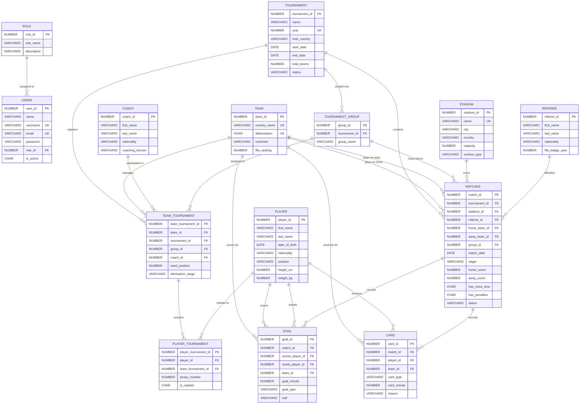

# ⚽ FIFA World Cup Management System

A full-stack web application for managing FIFA World Cup tournament data — built as a university database lab project demonstrating relational database design with Laravel + Oracle.

---

## 📋 Table of Contents

- [Project Overview](#project-overview)
- [Tech Stack](#tech-stack)
- [Features](#features)
- [Setup & Installation](#setup--installation)
- [Database Setup](#database-setup)
- [Test Accounts](#test-accounts)
- [Route Reference](#route-reference)
- [Database Schema](#database-schema)
- [ER Diagram](#er-diagram)
- [Feature Tests](#feature-tests)
- [Known Limitations & Scope Decisions](#known-limitations--scope-decisions)

---

## Project Overview

This system manages the full lifecycle of a FIFA World Cup tournament:

- **Admin panel** — full CRUD for tournaments, teams, players, coaches, stadiums, referees, and matches, including goal/card event entry per match
- **Public portal** — tournament overviews, live group standings (computed via a SQL VIEW), fixture listings, statistics leaderboards (top scorers, assist leaders, disciplinary table), team profiles, and global search
- **Role-based access control** — ADMIN vs VIEWER roles enforced at the middleware layer

The project intentionally targets a lab-realistic scope: every major relational database concept is demonstrated (1:M, M:N via junction tables, multi-FK patterns, composite UNIQUE constraints, RBAC auth, derived data via a SQL view, 3NF normalisation) without overreach into enterprise patterns.

---

## Tech Stack

| Layer | Technology |
|---|---|
| **Framework** | Laravel 11 (PHP 8.5) |
| **Database** | Oracle Database 21c XE |
| **Oracle Driver** | [`yajra/laravel-oci8`](https://github.com/yajra/laravel-pdo-via-oci8) |
| **Frontend** | Blade templates + Tailwind CSS 4 (via Vite) |
| **Alpine.js** | Interactive UI (dropdowns, dismissible flash messages) |
| **Authentication** | Laravel Breeze |
| **Testing** | PHPUnit / Laravel Feature Tests (SQLite in-memory) |
| **Dev Environment** | Oracle XE via Docker (`gvenzl/oracle-xe:21-slim`) |

---

## Features

### Admin Panel (`/admin/*`, ADMIN role required)

| Module | Capabilities |
|---|---|
| **Tournaments** | CRUD · Group management · Team registration with group/coach/seed assignment |
| **Teams** | CRUD · Continent/confederation tracking · FIFA ranking |
| **Coaches** | CRUD · License tracking |
| **Players** | CRUD · Position (GK/DF/MF/FW) · Physical attributes |
| **Stadiums** | CRUD · Capacity · Surface type |
| **Referees** | CRUD · Nationality · FIFA badge year |
| **Matches** | CRUD · Team assignment · Stage/group · Result entry |
| **Roster Management** | Add/remove players to team-tournament squads · Jersey number · Captain flag |
| **Goals & Cards** | Inline entry on match page · Scorer/assist from squad rosters |

### Public Portal (no login required)

| Page | URL |
|---|---|
| Home | `/` |
| Tournaments list | `/tournaments` |
| Tournament overview | `/tournaments/{id}` |
| Fixtures | `/tournaments/{id}/fixtures` |
| Group Standings | `/tournaments/{id}/standings` |
| Statistics | `/tournaments/{id}/stats` |
| Teams list | `/teams` |
| Team profile | `/teams/{id}` |
| Global Search | `/search?q=...` |

---

## Setup & Installation

### Prerequisites

- PHP 8.2+
- Composer
- Node.js + npm
- Oracle Instant Client 23.x (for the OCI8 PHP extension)
- Docker (recommended for Oracle XE) **or** an existing Oracle instance

### 1. Clone the Repository

```bash
git clone https://github.com/alifalahad/FifaWorldCup.git
cd FifaWorldCup
```

### 2. Install PHP Dependencies

```bash
composer install
```

### 3. Install Node Dependencies & Build Assets

```bash
npm install
npm run dev   # development mode with hot reload
# or
npm run build # production build
```

### 4. Configure Environment

```bash
cp .env.example .env
php artisan key:generate
```

Edit `.env` with your Oracle connection details:

```dotenv
DB_CONNECTION=oracle
DB_HOST=127.0.0.1
DB_PORT=1521
DB_SERVICE_NAME=XEPDB1
DB_DATABASE=XEPDB1
DB_USERNAME=your_oracle_username
DB_PASSWORD=your_oracle_password
DB_CHARSET=AL32UTF8
```

### 5. Start Oracle XE (Docker)

If using the provided Docker image:

```bash
# First run — creates and starts the container
docker run -d \
  --name oracle-xe \
  -p 1521:1521 \
  -e ORACLE_PASSWORD=YourStrongPassword \
  gvenzl/oracle-xe:21-slim

# Enable auto-restart (survives machine reboots)
docker update --restart=always oracle-xe

# Check it's healthy (takes ~60s to fully start)
docker logs oracle-xe --follow
```

> **Tip:** If you see `ORA-12541: Cannot connect. No listener` — the container is not running. Run `docker start oracle-xe` to bring it back up.

### 6. Run Migrations

```bash
php artisan migrate
```

> **Note:** Migrations include Oracle-specific DDL (`ALTER TABLE ADD CONSTRAINT CHECK`, `CREATE OR REPLACE VIEW`). These run only on Oracle; the SQLite test environment silently skips them via try/catch guards.

### 7. Seed Sample Data

```bash
php artisan db:seed
```

This creates:
- ADMIN and VIEWER roles
- Two test user accounts (see below)
- Sample tournaments, teams, stadiums, coaches, referees, groups, registered teams, and scheduled matches

### 8. Start the Dev Server

```bash
php artisan serve
```

Visit: **http://127.0.0.1:8000**

---

## Database Setup

### Oracle User / Schema

The application uses the `XEPDB1` pluggable database (Oracle XE default). If you need to create a dedicated schema:

```sql
-- Connect as SYSDBA
CREATE USER fifawc IDENTIFIED BY "YourPassword";
GRANT CONNECT, RESOURCE, CREATE VIEW TO fifawc;
ALTER USER fifawc QUOTA UNLIMITED ON USERS;
```

Then update `.env` with `DB_USERNAME=fifawc`.

### Running Migrations on a Fresh Oracle Instance

```bash
php artisan migrate --force
```

### Resetting Everything

```bash
php artisan migrate:fresh --seed
```

---

## Test Accounts

Both accounts are created by `php artisan db:seed`.

| Role | Email | Username | Password | Access |
|---|---|---|---|---|
| **ADMIN** | `admin@fifawc.test` | `admin` | `password` | Full admin panel + all public pages |
| **VIEWER** | `viewer@fifawc.test` | `viewer` | `password` | Public pages only; admin redirects to home |

Login at: **http://127.0.0.1:8000/login**

---

## Route Reference

### Public Routes

```
GET  /                                      # Home page
GET  /tournaments                           # Tournament list (filter by year/status)
GET  /tournaments/{id}                      # Tournament overview
GET  /tournaments/{id}/fixtures             # Match fixtures grouped by stage
GET  /tournaments/{id}/standings            # Group standings (from GROUP_STANDINGS view)
GET  /tournaments/{id}/stats                # Top scorers, assist leaders, disciplinary table
GET  /teams                                 # Team list (searchable, filterable by confederation)
GET  /teams/{id}                            # Team profile + tournament history
GET  /search?q=...                          # Global search (teams, players, coaches)
```

### Admin Routes (require ADMIN role)

```
GET|POST        /admin/tournaments
GET             /admin/tournaments/{id}
GET|PUT|DELETE  /admin/tournaments/{id}/edit
GET|POST        /admin/tournaments/{id}/register-team

GET|POST        /admin/teams
GET|PUT|DELETE  /admin/teams/{id}/edit

GET|POST        /admin/coaches
GET|PUT|DELETE  /admin/coaches/{id}/edit

GET|POST        /admin/players
GET|PUT|DELETE  /admin/players/{id}/edit

GET|POST        /admin/stadiums
GET|PUT|DELETE  /admin/stadiums/{id}/edit

GET|POST        /admin/referees
GET|PUT|DELETE  /admin/referees/{id}/edit

GET|POST        /admin/matches
GET|PUT|DELETE  /admin/matches/{id}/edit
GET|POST        /admin/matches/{id}/result   # Enter/update match scores

GET|POST        /admin/team-tournament/{id}/roster
DELETE          /admin/team-tournament/{id}/roster/{player}
```

---

## Database Schema

**14 physical tables + 1 SQL view**, all in 3NF.

### Auth Layer

| Table | Description | Key Columns |
|---|---|---|
| `roles` | RBAC roles lookup | `role_id` PK, `role_name` UNIQUE (`ADMIN`, `VIEWER`) |
| `users` | Authenticated users | `user_id` PK, `username` UNIQUE, `email` UNIQUE, `role_id` FK, `is_active` CHAR(Y/N) |

### Core Entities

| Table | Description | Key Constraints |
|---|---|---|
| `tournaments` | World Cup editions | `year` UNIQUE, status CHECK (`PLANNED`/`ONGOING`/`COMPLETED`/`CANCELLED`) |
| `teams` | National teams | `country_name` UNIQUE, `abbreviation` CHAR(3) UNIQUE, continent CHECK (6 confederations) |
| `coaches` | Team coaches | — |
| `players` | Individual players | position CHECK (`GK`/`DF`/`MF`/`FW`) |
| `stadiums` | Match venues | `name` UNIQUE, surface_type CHECK (`GRASS`/`ARTIFICIAL`/`HYBRID`/`NATURAL GRASS`) |
| `referees` | Match officials | — |

### Structural

| Table | Description | Key Constraints |
|---|---|---|
| `tournament_groups` | Group A–H within a tournament | `group_name` UNIQUE per tournament (composite) |

### Junction Tables (M:N)

| Table | Resolves | Key Constraints |
|---|---|---|
| `team_tournament` | TEAM ↔ TOURNAMENT | UNIQUE (`team_id`, `tournament_id`); carries `group_id`, `coach_id`, `seed_position`, `elimination_stage` |
| `player_tournament` | PLAYER ↔ TEAM_TOURNAMENT | UNIQUE (`player_id`, `team_tournament_id`); carries `jersey_number` (unique per squad), `is_captain` CHAR(Y/N) |

### Matches & Events

| Table | Description | Key Constraints |
|---|---|---|
| `matches` | Individual matches | stage CHECK (6 stages), status CHECK (5 values), `home_team_id != away_team_id`, `group_id` NULL for knockout stages |
| `goals` | Goal events | goal_type CHECK (`OPEN_PLAY`/`PENALTY`/`FREE_KICK`/`HEADER`/`OWN_GOAL`), half nullable |
| `cards` | Disciplinary events | card_type CHECK (`YELLOW`/`RED`/`SECOND_YELLOW`) |

### View

| View | Description |
|---|---|
| `group_standings` | Live group standings computed from `COMPLETED` group-stage matches via CTE — replaces a physical table to eliminate stale-data risk |

#### Group Standings View SQL

```sql
CREATE OR REPLACE VIEW group_standings AS
WITH match_results AS (
    SELECT tournament_id, group_id, home_team_id AS team_id,
           home_score AS goals_for, away_score AS goals_against
    FROM matches WHERE stage = 'GROUP' AND status = 'COMPLETED'
    UNION ALL
    SELECT tournament_id, group_id, away_team_id AS team_id,
           away_score AS goals_for, home_score AS goals_against
    FROM matches WHERE stage = 'GROUP' AND status = 'COMPLETED'
)
SELECT group_id, tournament_id, team_id,
    COUNT(*)                                                         AS played,
    SUM(CASE WHEN goals_for > goals_against THEN 1 ELSE 0 END)       AS won,
    SUM(CASE WHEN goals_for = goals_against THEN 1 ELSE 0 END)       AS drawn,
    SUM(CASE WHEN goals_for < goals_against THEN 1 ELSE 0 END)       AS lost,
    SUM(goals_for)                                                   AS goals_for,
    SUM(goals_against)                                               AS goals_against,
    SUM(goals_for) - SUM(goals_against)                              AS goal_difference,
    SUM(CASE WHEN goals_for > goals_against THEN 3
             WHEN goals_for = goals_against THEN 1 ELSE 0 END)       AS points
FROM match_results
GROUP BY group_id, tournament_id, team_id;
```

---

## ER Diagram



---

## Feature Tests

Tests run against SQLite in-memory (no Oracle required). Oracle-specific DDL is silently skipped on SQLite via `try/catch` guards in migrations.

```bash
php artisan test tests/Feature/WorldCupBusinessRulesTest.php
```

**9 tests, all passing:**

| # | Test | What It Proves |
|---|---|---|
| 1 | Unauthenticated GET `/admin` → redirect to `/login` | Auth middleware works |
| 2 | Unauthenticated POST to admin → redirect to `/login` | Auth middleware on write |
| 3 | VIEWER role → redirect to `/home` with error flash | Role middleware rejects wrong role |
| 4 | ADMIN role → `200 OK` on admin index | Role middleware allows correct role |
| 5 | Duplicate tournament year → validation error, DB count stays 1 | Unique constraint + friendly error |
| 6 | Unique tournament year → created + redirect | Happy path |
| 7 | Register same team twice → `team_id` validation error, DB count stays 1 | Composite unique constraint |
| 8 | Completed group match → correct `group_standings` VIEW output (GF/GA/GD/Pts) | View logic is correct |
| 9 | Scheduled match → does NOT appear in standings | View only counts `COMPLETED` |

---

## Known Limitations & Scope Decisions

These are intentional design choices made to keep the project within a realistic lab timeline. Each is justified in [`fifa_world_cup_database_design_v2_1.md`](./fifa_world_cup_database_design_v2_1.md) (§1 — Changes & Rationale).

### 1. One referee per match (not a full officiating crew)

**Reality:** FIFA assigns 6 officials per match (main referee, 2 assistants, 4th official, 2 VAR officials).

**Decision:** A single `referee_id` FK on the `MATCHES` table. The project already demonstrates M:N relationships via `TEAM_TOURNAMENT` and `PLAYER_TOURNAMENT` — adding a `MATCH_REFEREE` junction table for 6 roles would duplicate that pattern without adding grading value.

### 2. No generic match events timeline

**Reality:** Production football databases track every event: kickoff, halftime, full-time, substitutions, VAR reviews, injury time, etc.

**Decision:** Only `GOAL` and `CARD` events are modelled. A generic `MATCH_EVENT` table was cut from the design because it would have required a full CRUD module for primarily UI-flavour data — the goal/card pair already demonstrates event-to-match 1:M relationships clearly.

### 3. Group standings via view, not a physical table

**Reality:** Storing standings as a physical `GROUP_STANDING` table is a common approach but creates a synchronisation problem — the table goes stale whenever a match result is entered or corrected.

**Decision:** Replaced with a live SQL `VIEW` (`group_standings`) that computes standings directly from completed match results using a CTE. This is the architecturally correct solution: zero maintenance code, always consistent, and demonstrates Oracle's view/CTE capabilities.

### 4. Max squad size enforced at application level only

The 26-player squad limit is enforced in `RosterController` via PHP logic, not at the database level (Oracle doesn't support a practical row-count constraint per foreign key group without triggers). This is a deliberate simplification — a production system would use a database trigger or a scheduled integrity check.

### 5. Player search is basic LIKE, not full-text

The `/search` endpoint uses simple `LIKE '%query%'` queries. Oracle's full-text search (`CONTAINS`, `CTXCAT` indexes) and relevance ranking are out of scope. For a lab project processing < 1000 entities, `LIKE` queries are fast enough.

### 6. No real-time features

Match scores, group standings, and statistics are loaded fresh on each page request — no WebSockets, server-sent events, or automatic page refresh. Adding real-time updates (e.g. via Laravel Echo + Pusher) would be a natural extension for a production version.

---

## Project Structure

```
app/
├── Http/
│   ├── Controllers/
│   │   ├── Admin/          # Admin CRUD controllers (14 files)
│   │   └── Public/         # Public-facing controllers (6 files)
│   ├── Middleware/
│   │   └── EnsureUserHasRole.php   # role:ADMIN middleware
│   └── Requests/Admin/     # Form Request validation (16 files)
├── Models/                 # Eloquent models (14 models + GroupStanding view-model)
database/
├── migrations/             # 13 migration files (ordered by FK dependency)
├── seeders/
│   ├── RoleSeeder.php
│   └── SampleDataSeeder.php
resources/views/
├── layouts/
│   ├── app.blade.php       # Public layout (nav + flash + footer)
│   └── admin.blade.php     # Admin layout
├── admin/                  # Admin views (tournaments, teams, players, matches, etc.)
├── public/                 # Public views (tournaments, teams, search)
└── errors/                 # Custom 403, 404, 500 pages
tests/
├── FifaTestCase.php        # Base test class (SQLite + Oracle DDL compat)
└── Feature/
    └── WorldCupBusinessRulesTest.php   # 9 feature tests
```

---

## Design Document

Full database design rationale, normalisation analysis, and schema specification:
**[`fifa_world_cup_database_design_v2_1.md`](./fifa_world_cup_database_design_v2_1.md)**

---

*Built with Laravel 11 + Oracle 21c XE · University Database Lab Project*
