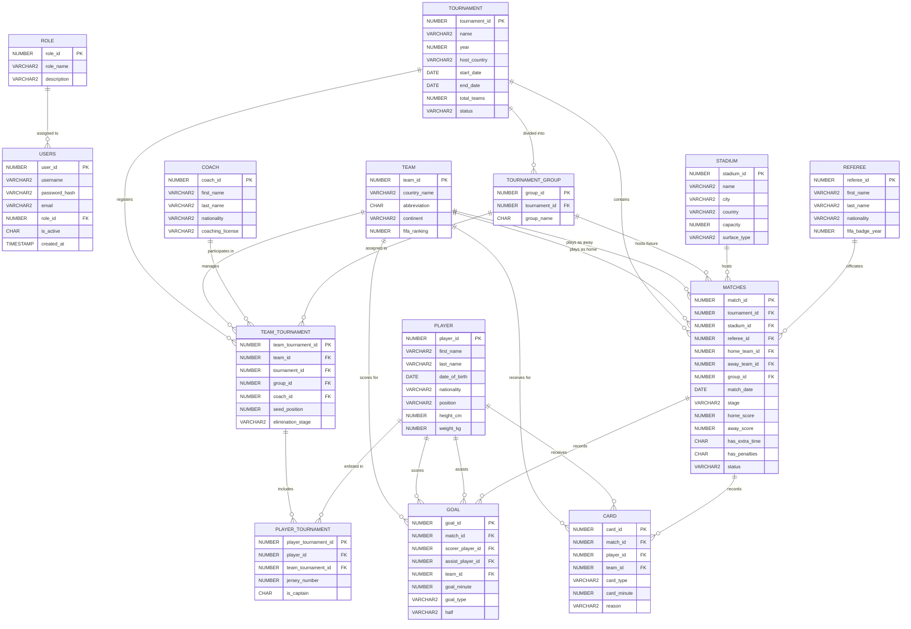

# FIFA World Cup Management System — Database Design (Revised v2)

**Stack:** Laravel + Oracle Database
**Scope:** Web lab project — trimmed for realistic build time while keeping every core DB/web concept a lab rubric checks for (1:M, M:N via junction tables, multi-FK/self-referencing FK, RBAC auth, derived/reporting data via a SQL view, normalization to 3NF).

---

## 1. What changed from the original design, and why

| # | Change | Reason |
|---|--------|--------|
| 1 | **Removed `GROUP_STANDING` table → replaced with a `GROUP_STANDINGS` SQL VIEW** | Every column in it (`played`, `won`, `drawn`, `goals_for`, `points`...) is 100% derivable from `MATCHES`. Storing it separately means it can go **out of sync** with actual results unless you write trigger/observer logic to update it after every match — a real bug risk on a lab-project timeline. A view computes it live, always correct, zero maintenance code. |
| 2 | **Removed `MATCH_EVENT` table** | It stored generic timeline rows (kickoff/halftime/fulltime/VAR review/substitution). This is UI flavor, not a distinct relationship concept — you already prove you can model events with `GOAL` and `CARD`. Cutting it removes a full CRUD module for no grading benefit. |
| 3 | **Removed `MATCH_REFEREE` junction table → `referee_id` is now a direct FK on `MATCHES`** | A 5-person officiating crew (main/2 assistants/4th official/VAR) is realistic but not necessary to *demonstrate* M:N — you already have two clean M:N examples (`TEAM_TOURNAMENT`, `PLAYER_TOURNAMENT`). One referee per match is enough to justify the `REFEREE` entity and a clean 1:M relationship. |
| 4 | Everything else (tournaments, teams, players, coaches, groups, goals, cards, roles/auth) | Kept as-is — these were correctly modeled in the original and each demonstrates a genuinely different relationship pattern. |

**Result: 17 physical tables → 14 physical tables + 1 view.**

If you're still tight on time, the tables marked **[Tier 2]** below (`COACH`, `CARD`, `REFEREE`) can be cut too without breaking anything — see §2.

---

## 2. Final Table List (by priority tier)

**Tier 1 — Core (build these first, the project works without anything else):**
`ROLE`, `USERS`, `TOURNAMENT`, `TEAM`, `PLAYER`, `STADIUM`, `TOURNAMENT_GROUP`, `TEAM_TOURNAMENT`, `PLAYER_TOURNAMENT`, `MATCHES`, `GOAL` — **11 tables**

**Tier 2 — Adds relationship variety to the ER diagram, still lightweight (recommended, keeps the project feeling complete):**
`COACH`, `REFEREE`, `CARD` — **+3 tables = 14 total**

**Not included (cut for scope, see §1):** ~~`MATCH_EVENT`~~, ~~`MATCH_REFEREE`~~, ~~`GROUP_STANDING` table~~ (now a view)

---

## 3. ER Diagram (Crow's Foot Notation)



*(`GROUP_STANDINGS` is deliberately **not** drawn as an entity box — it's a view, not a table. See §6.)*

---

## 4. Table Specifications

### 4.1 ROLE
| Column | Type | Constraints |
|---|---|---|
| role_id | NUMBER(10) | PK, IDENTITY |
| role_name | VARCHAR2(50) | NOT NULL, UNIQUE (e.g. ADMIN, VIEWER) |
| description | VARCHAR2(255) | |

### 4.2 USERS
| Column | Type | Constraints |
|---|---|---|
| user_id | NUMBER(10) | PK, IDENTITY |
| username | VARCHAR2(50) | NOT NULL, UNIQUE |
| password_hash | VARCHAR2(256) | NOT NULL |
| email | VARCHAR2(100) | NOT NULL, UNIQUE |
| role_id | NUMBER(10) | FK → ROLE, NOT NULL |
| is_active | CHAR(1) | DEFAULT 'Y', CHECK (Y/N) |
| created_at | TIMESTAMP | DEFAULT SYSTIMESTAMP |

> Two roles is enough for the lab: **ADMIN** (manages tournaments/teams/matches through Laravel CRUD) and **VIEWER** (read-only, or just leave public pages unauthenticated and skip VIEWER entirely if your rubric only asks for one protected role).

### 4.3 TOURNAMENT
| Column | Type | Constraints |
|---|---|---|
| tournament_id | NUMBER(10) | PK, IDENTITY |
| name | VARCHAR2(100) | NOT NULL |
| year | NUMBER(4) | NOT NULL, UNIQUE |
| host_country | VARCHAR2(100) | NOT NULL |
| start_date | DATE | NOT NULL |
| end_date | DATE | NOT NULL |
| total_teams | NUMBER(3) | DEFAULT 32 |
| status | VARCHAR2(20) | DEFAULT 'PLANNED', CHECK (PLANNED/ONGOING/COMPLETED/CANCELLED) |

### 4.4 TEAM
| Column | Type | Constraints |
|---|---|---|
| team_id | NUMBER(10) | PK, IDENTITY |
| country_name | VARCHAR2(100) | NOT NULL, UNIQUE |
| abbreviation | CHAR(3) | NOT NULL, UNIQUE |
| continent | VARCHAR2(50) | NOT NULL, CHECK (confederation) |
| fifa_ranking | NUMBER(5) | |

### 4.5 COACH *(Tier 2)*
| Column | Type | Constraints |
|---|---|---|
| coach_id | NUMBER(10) | PK, IDENTITY |
| first_name | VARCHAR2(50) | NOT NULL |
| last_name | VARCHAR2(50) | NOT NULL |
| nationality | VARCHAR2(100) | NOT NULL |
| coaching_license | VARCHAR2(50) | |

Linked per-tournament via `TEAM_TOURNAMENT.coach_id`, not directly to `TEAM` — this correctly models that the same national team can have different coaches in different World Cups.

### 4.6 PLAYER
| Column | Type | Constraints |
|---|---|---|
| player_id | NUMBER(10) | PK, IDENTITY |
| first_name | VARCHAR2(50) | NOT NULL |
| last_name | VARCHAR2(50) | NOT NULL |
| date_of_birth | DATE | NOT NULL |
| nationality | VARCHAR2(100) | NOT NULL |
| position | VARCHAR2(20) | NOT NULL, CHECK (GK/DF/MF/FW) |
| height_cm | NUMBER(5,2) | |
| weight_kg | NUMBER(5,2) | |

### 4.7 STADIUM
| Column | Type | Constraints |
|---|---|---|
| stadium_id | NUMBER(10) | PK, IDENTITY |
| name | VARCHAR2(150) | NOT NULL |
| city | VARCHAR2(100) | NOT NULL |
| country | VARCHAR2(100) | NOT NULL |
| capacity | NUMBER(8) | NOT NULL |
| surface_type | VARCHAR2(50) | DEFAULT 'NATURAL GRASS' |

### 4.8 REFEREE *(Tier 2)*
| Column | Type | Constraints |
|---|---|---|
| referee_id | NUMBER(10) | PK, IDENTITY |
| first_name | VARCHAR2(50) | NOT NULL |
| last_name | VARCHAR2(50) | NOT NULL |
| nationality | VARCHAR2(100) | NOT NULL |
| fifa_badge_year | NUMBER(4) | |

### 4.9 TOURNAMENT_GROUP
| Column | Type | Constraints |
|---|---|---|
| group_id | NUMBER(10) | PK, IDENTITY |
| tournament_id | NUMBER(10) | FK → TOURNAMENT, NOT NULL |
| group_name | CHAR(1) | NOT NULL, CHECK (A–L) |

**Composite UNIQUE:** (tournament_id, group_name)

### 4.10 TEAM_TOURNAMENT *(Junction — resolves TEAM ↔ TOURNAMENT M:N)*
| Column | Type | Constraints |
|---|---|---|
| team_tournament_id | NUMBER(10) | PK, IDENTITY |
| team_id | NUMBER(10) | FK → TEAM, NOT NULL |
| tournament_id | NUMBER(10) | FK → TOURNAMENT, NOT NULL |
| group_id | NUMBER(10) | FK → TOURNAMENT_GROUP, nullable (unset until group draw) |
| coach_id | NUMBER(10) | FK → COACH, nullable |
| seed_position | NUMBER(2) | |
| elimination_stage | VARCHAR2(30) | CHECK, nullable until team is out |

**Composite UNIQUE:** (team_id, tournament_id)

### 4.11 PLAYER_TOURNAMENT *(Junction — resolves PLAYER ↔ TOURNAMENT M:N)*
| Column | Type | Constraints |
|---|---|---|
| player_tournament_id | NUMBER(10) | PK, IDENTITY |
| player_id | NUMBER(10) | FK → PLAYER, NOT NULL |
| team_tournament_id | NUMBER(10) | FK → TEAM_TOURNAMENT, NOT NULL |
| jersey_number | NUMBER(3) | NOT NULL |
| is_captain | CHAR(1) | DEFAULT 'N', CHECK (Y/N) |

**Composite UNIQUE:** (player_id, team_tournament_id)

### 4.12 MATCHES
| Column | Type | Constraints |
|---|---|---|
| match_id | NUMBER(10) | PK, IDENTITY |
| tournament_id | NUMBER(10) | FK → TOURNAMENT, NOT NULL |
| stadium_id | NUMBER(10) | FK → STADIUM, NOT NULL |
| referee_id | NUMBER(10) | FK → REFEREE, nullable (assigned closer to match day) |
| home_team_id | NUMBER(10) | FK → TEAM, NOT NULL |
| away_team_id | NUMBER(10) | FK → TEAM, NOT NULL |
| group_id | NUMBER(10) | FK → TOURNAMENT_GROUP, nullable (NULL = knockout match) |
| match_date | DATE | NOT NULL |
| stage | VARCHAR2(30) | NOT NULL, CHECK (GROUP/ROUND_OF_16/QUARTER_FINAL/SEMI_FINAL/THIRD_PLACE/FINAL) |
| home_score | NUMBER(3) | |
| away_score | NUMBER(3) | |
| has_extra_time | CHAR(1) | DEFAULT 'N' |
| has_penalties | CHAR(1) | DEFAULT 'N' |
| status | VARCHAR2(20) | DEFAULT 'SCHEDULED', CHECK (SCHEDULED/LIVE/COMPLETED/POSTPONED/CANCELLED) |

**Business rule:** `CHECK (home_team_id != away_team_id)`

### 4.13 GOAL
| Column | Type | Constraints |
|---|---|---|
| goal_id | NUMBER(10) | PK, IDENTITY |
| match_id | NUMBER(10) | FK → MATCHES, NOT NULL |
| scorer_player_id | NUMBER(10) | FK → PLAYER, NOT NULL |
| assist_player_id | NUMBER(10) | FK → PLAYER, nullable |
| team_id | NUMBER(10) | FK → TEAM, NOT NULL — credited team (opponent for own goals) |
| goal_minute | NUMBER(3) | NOT NULL |
| goal_type | VARCHAR2(20) | DEFAULT 'OPEN_PLAY', CHECK (OPEN_PLAY/PENALTY/FREE_KICK/HEADER/OWN_GOAL) |
| half | VARCHAR2(5) | CHECK (1ST/2ND/ET1/ET2) |

### 4.14 CARD *(Tier 2)*
| Column | Type | Constraints |
|---|---|---|
| card_id | NUMBER(10) | PK, IDENTITY |
| match_id | NUMBER(10) | FK → MATCHES, NOT NULL |
| player_id | NUMBER(10) | FK → PLAYER, NOT NULL |
| team_id | NUMBER(10) | FK → TEAM, NOT NULL |
| card_type | VARCHAR2(20) | NOT NULL, CHECK (YELLOW/RED/SECOND_YELLOW) |
| card_minute | NUMBER(3) | NOT NULL |
| reason | VARCHAR2(255) | |

---

## 5. Relationship & Cardinality Summary

**1:M relationships**
| Relationship | Cardinality |
|---|---|
| ROLE → USERS | 1:M |
| TOURNAMENT → TOURNAMENT_GROUP | 1:M |
| TOURNAMENT → MATCHES | 1:M |
| STADIUM → MATCHES | 1:M |
| REFEREE → MATCHES | 1:M |
| MATCHES → GOAL | 1:M |
| MATCHES → CARD | 1:M |

**M:N relationships (via junction tables)**
| Relationship | Junction | Notes |
|---|---|---|
| TEAM ↔ TOURNAMENT | TEAM_TOURNAMENT | Also carries group, coach, seed, elimination stage per edition |
| PLAYER ↔ TOURNAMENT | PLAYER_TOURNAMENT (via TEAM_TOURNAMENT) | Carries jersey number & captaincy per edition |

**Multi-FK / self-referencing patterns**
| Table | Pattern |
|---|---|
| MATCHES | Two FKs to TEAM (`home_team_id`, `away_team_id`) — the classic "plays against" pattern |
| GOAL | Two FKs to PLAYER (`scorer_player_id` mandatory, `assist_player_id` optional) |

---

## 6. The `GROUP_STANDINGS` View (replaces the old physical table)

This is the fix for the redundancy problem described in §1. Oracle SQL:

```sql
CREATE OR REPLACE VIEW group_standings AS
WITH match_results AS (
    SELECT tournament_id, group_id, home_team_id AS team_id,
           home_score AS goals_for, away_score AS goals_against
    FROM matches
    WHERE stage = 'GROUP' AND status = 'COMPLETED'
    UNION ALL
    SELECT tournament_id, group_id, away_team_id AS team_id,
           away_score AS goals_for, home_score AS goals_against
    FROM matches
    WHERE stage = 'GROUP' AND status = 'COMPLETED'
)
SELECT
    group_id,
    tournament_id,
    team_id,
    COUNT(*)                                                            AS played,
    SUM(CASE WHEN goals_for > goals_against THEN 1 ELSE 0 END)          AS won,
    SUM(CASE WHEN goals_for = goals_against THEN 1 ELSE 0 END)          AS drawn,
    SUM(CASE WHEN goals_for < goals_against THEN 1 ELSE 0 END)          AS lost,
    SUM(goals_for)                                                      AS goals_for,
    SUM(goals_against)                                                  AS goals_against,
    SUM(goals_for) - SUM(goals_against)                                 AS goal_difference,
    SUM(CASE WHEN goals_for > goals_against THEN 3
             WHEN goals_for = goals_against THEN 1 ELSE 0 END)          AS points
FROM match_results
GROUP BY group_id, tournament_id, team_id;
```

To get ranked standings (1st, 2nd, 3rd, 4th in each group), rank at query time rather than storing a `position` column:

```sql
SELECT gs.*,
       RANK() OVER (PARTITION BY group_id ORDER BY points DESC, goal_difference DESC, goals_for DESC) AS position
FROM group_standings gs
WHERE group_id = :group_id;
```

This always reflects the latest results the moment you enter a score in Laravel — no jobs, no observers, no stale data.

---

## 7. Normalization (to 3NF)

- **1NF:** every table has atomic columns and a single-column surrogate PK — satisfied throughout.
- **2NF:** surrogate PKs mean no partial dependency is possible on the PK itself; junction tables enforce the real business key via composite UNIQUE constraints (e.g. `PLAYER_TOURNAMENT.jersey_number` depends on the full (player_id, team_tournament_id) pair, backed by that unique constraint).
- **3NF:** no transitive dependencies remain. The one previously borderline case — `team_id` in `GOAL` and `CARD` looking derivable from `player_id → PLAYER → TEAM` — is intentionally kept because (a) own goals credit the *opposing* team, and (b) a player's tournament team can differ from a hardcoded "current team," so it isn't actually derivable without also joining through `PLAYER_TOURNAMENT` and `TEAM_TOURNAMENT`. This is a justified design choice, not a violation.
- The one genuine normalization problem in the original design — **derived match statistics stored as a physical table (`GROUP_STANDING`)** — is fixed in §6 by making it a view instead.

---

## 8. Laravel Implementation Notes

- **Oracle driver:** Laravel doesn't ship Oracle support out of the box — use the `yajra/laravel-oci8` package for the Eloquent/Oracle bridge.
- **Migration order** (respects FK dependencies): `roles` → `users` → `tournaments` → `teams` → `coaches` → `players` → `stadiums` → `referees` → `tournament_groups` → `team_tournament` → `player_tournament` → `matches` → `goals` → `cards`.
- **Key Eloquent relationships:**
  ```php
  // Tournament.php
  public function groups() { return $this->hasMany(TournamentGroup::class); }
  public function matches() { return $this->hasMany(Match::class); }
  public function teamTournaments() { return $this->hasMany(TeamTournament::class); }

  // Team.php
  public function tournaments() { return $this->belongsToMany(Tournament::class, 'team_tournament'); }

  // Match.php
  public function homeTeam() { return $this->belongsTo(Team::class, 'home_team_id'); }
  public function awayTeam() { return $this->belongsTo(Team::class, 'away_team_id'); }
  public function goals() { return $this->hasMany(Goal::class); }
  public function cards() { return $this->hasMany(Card::class); }

  // Goal.php
  public function scorer() { return $this->belongsTo(Player::class, 'scorer_player_id'); }
  public function assister() { return $this->belongsTo(Player::class, 'assist_player_id'); }
  ```
- **Standings view as a model:**
  ```php
  class GroupStanding extends Model {
      protected $table = 'group_standings';
      public $timestamps = false;
      protected $primaryKey = null;   // view has no single-row PK
      public $incrementing = false;
  }
  ```

---

## 9. Table Count Summary

| Category | Count | Tables |
|---|---|---|
| Auth | 2 | ROLE, USERS |
| Core entities | 6 | TOURNAMENT, TEAM, COACH, PLAYER, STADIUM, REFEREE |
| Structural | 1 | TOURNAMENT_GROUP |
| Junctions (M:N) | 2 | TEAM_TOURNAMENT, PLAYER_TOURNAMENT |
| Match & events | 3 | MATCHES, GOAL, CARD |
| **Total physical tables** | **14** | |
| Views | 1 | GROUP_STANDINGS |

Want me to also generate the actual Oracle `CREATE TABLE` DDL script and/or the Laravel migration files from this design?
